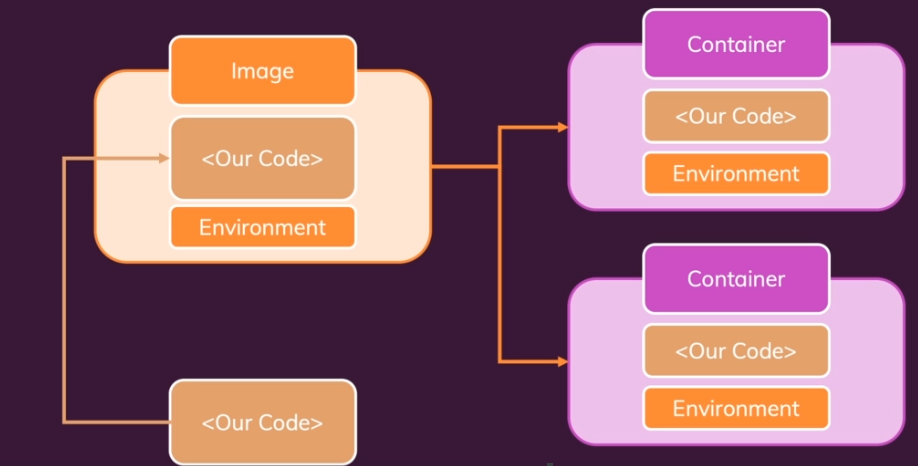

# Images and containers

An image is a template/blueprint for a container.
It contains the code + required tools/runtimes.

A container is a running unit of software.

A single image can be used to create multiple containers.

A public centralized location for images is the Docker Hub.
It contains official and community shared images.

The workflow with Docker usually looks like so:
* We pull in an existing image (ex. Node)
* We build on top of that image

When we want to create our own image, we need to start by creating a `Dockerfile`.
This is a special name that will be identified by Docker.

The file system in Docker is completely hidden away from our OS.

Once we have a `Dockerfile`, we need to build it into an image.
A `Dockerfile` is simply a blueprint.

The build process outputs an ID, which can be used to run the image.

If we run a command that doesn't finish (ex. starting a server), then the `docker run <id>` command won't exit either.

Whereas the `Dockerfile` has an `EXPOSE` statement, it is simply for documentation purposes.
To actually expose a port, we need to include a property in our run command.
`-p <portOnHost>:<portInsideContainer>`. This exposes a Docker port to a port on our host machine.

A note about targeting by IDs.
Docker requires only as much of the ID as is needed to uniquely identify the container.
If you have only a single container that starts with an "a", then you could just do `docker run a`.

Docker images are read-only.
Once you create them, and then start changing things related to your Dockerfile, then that won't change anything in an existing image.
You have to re-build it to generate a new image with the new info.

Docker uses layers in its image.
Each line in the Dockerfile is a layer.
Each layer is cached.
When you change a line or data related to a layer, then all layers after that layer will need to be rebuilt.
Docker decides to rebuild a layer if the output of that layer has changed.
If the output is the same, then it will use the cached layer.

So if we have changing code that is being copied over, and we want to isolate it, then we can put it in a separate layer.

A container does not copy anything from the image.
All it does is reference the image.
It adds a read/write layer on top of the image.
This is called the container layer.
All changes made to the running container, such as writing new files, modifying existing files, and deleting files, are written to this layer.

