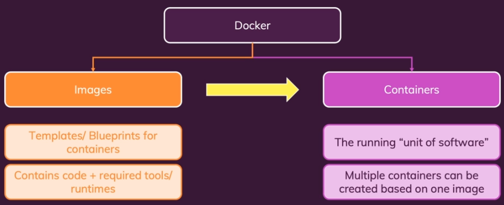
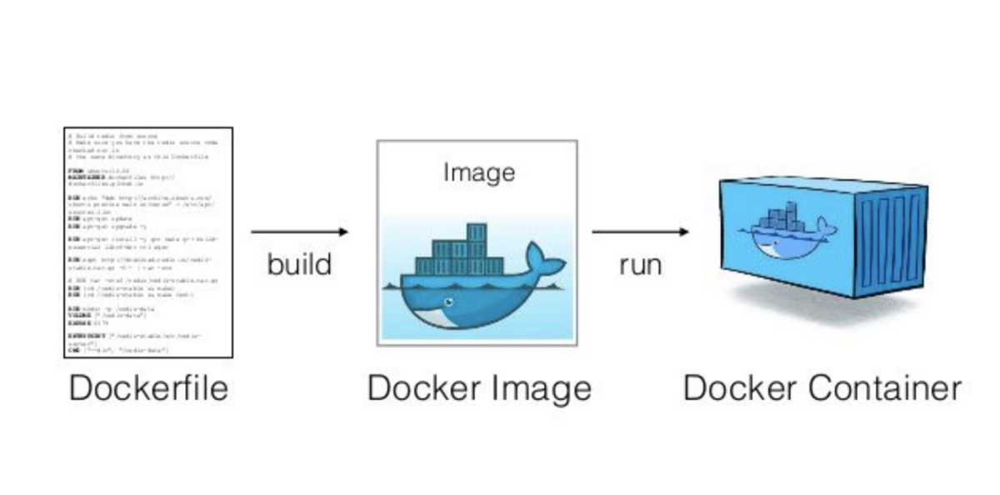
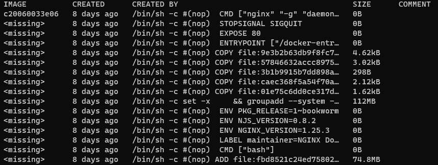
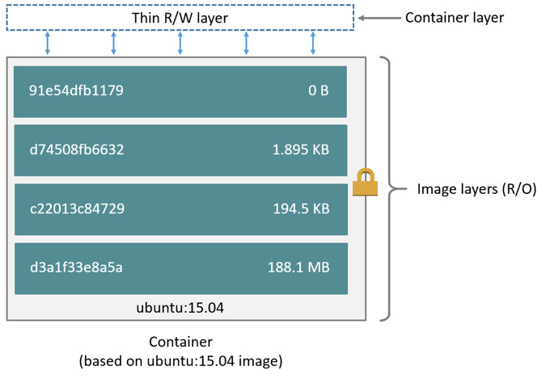
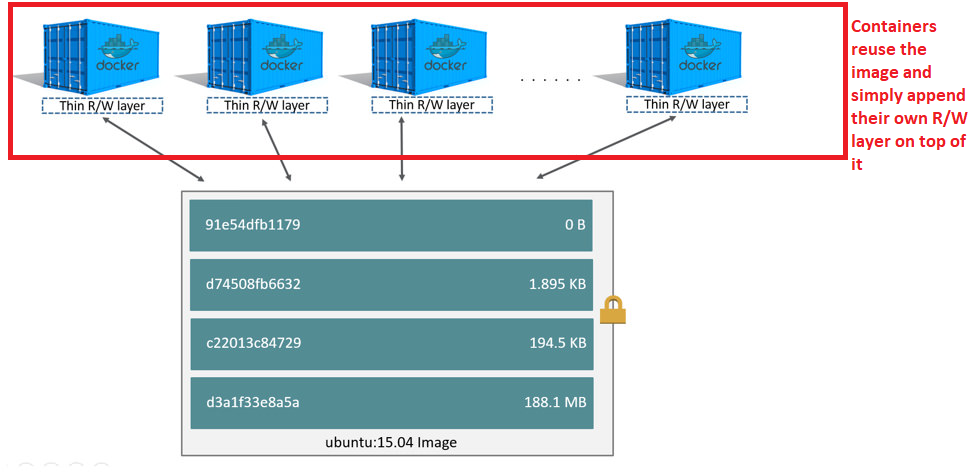
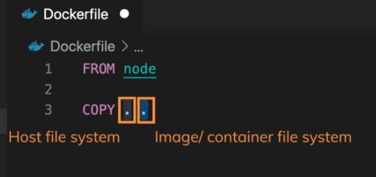
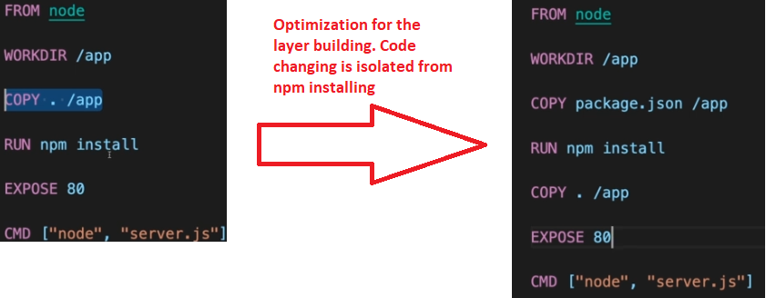

# Images and containers


## What happens in `docker container run`?
1. Looks for that image locally in image cache, doesn't find anything.
2. Looks in remote image repository (defaults to Docker Hub)
3. Downloads the latest version (nginx:latest by default)
4. Creates new container based on that image and prepares to start
5. Gives it a virtual IP on a private network inside Docker Engine
6. (If the publish flag was specified) Opens up port 80 on host and forwards to port 80 in the container
7. Starts the container by using the CMD definition in the image Dockerfile


## Container vs Image vs Dockerfile
A Dockerfile is used to build an image.

An image is a template/blueprint for a container.

It contains:
* App binaries and dependencies
* Metadata about the image data and how to run the image

A container is a running unit of software.

A single image can be used to create multiple containers.




## Docker Hub

The workflow with Docker usually looks like so:
* We pull in an existing image (ex. Node)
* We build on top of that image

A public centralized location for images is the Docker Hub.
It contains official and community shared images.

When choosing images, we should always look at official ones first.
A team at Docker helps manage the official images.

If the official one doesn't work for you, then go by popularity.
It's always a good idea to check the source code of the non-official image that you're downloading.

To get a specific version of a dependency, you can use a tag.
By default, you get the latest.
It isn't necessarily the latest commit, but the latest version of the product.

When going to production, you'll want a specific version.

If you look at the list of images that you have, then you'll notice that each of them has a hash and the size that they take up.
Each one with the same hash doesn't take up the space specified.
The ones with the same hash only take up the space once.

When referring to an image, then we have 3 bits of information to use to refer to them:
* User
* Repo
* Tag

Official images skip the user bit.

If a tag is omitted, then the `latest` tag is used.

```
<user>/<repo>:<tag> //Custom
mysql/mysql-server:latest

<repo>:<tag> //Official
nginx:latest
```

A tag is a pointer to a specific image commit.

The latest tag doesn't necessarily reference the latest one.
You can tag some old software with the latest.
It's just a convention that you should use latest for the latest.
On official images, you can trust latest to be the latest.

## Layers

Docker uses a union file system. 
It allows for different directories to form a single coherent file system.
It basically binds separate folders into one whole, while keeping the folders still as separate entities.

In Docker terms, each of those folders would be a layer.
Multiple layers make up an image.

When you look at a Docker image, then you'll see that there are multiple layers described.
Each of them might have a separate created time.

The `<missing>` part is just the wrong nomenclature. 
It just means that they aren't images themselves.
Only the layer that makes up the full image has the value set.
Regular layers still have hashes.



Each line in the Dockerfile is a layer.
Each layer is cached.
When you change a line or data related to a layer, then all layers after that layer will need to be rebuilt.
Docker decides to rebuild a layer if the output of that layer has changed.
If the output is the same, then it will use the cached layer.

An image will re-use the cached layers whenever possible.

A container does not copy anything from the image.
All it does is reference the image.
It adds a read/write layer on top of the image.
This is called the container layer.
All changes made to the running container, such as writing new files, modifying existing files, and deleting files, are written to this layer.



## Dockerfile

When we want to create our own image, we need to start by creating a `Dockerfile`.
This is a special name that will be identified by Docker.

When using a Dockerfile, however, you can also specify another name.
```
docker build -f some-dockerfile
```

```Dockerfile
# The FROM is always required.
# It is normally a minimal distribution. It's usually alpine nowadays.
# You'd mainly want a Linux distribution to use their package managers to install things.
FROM debina:jessie

# You can define environment variables with this.
# It's an optional property.
ENV SOME_VALUE some-value

# Optional commands that are run in the shell at build time
# If you chain commands in a single RUN (&& ... &&), then all of those will be put into a single layer.
# So if there are things that should be grouped together, make it so that layer caching would work properly.
RUN echo "${SOME_VALUE}"

# You can have multiple RUN commands
RUN echo "Hello"

# Optional. Informative to the consumer on what ports can be used.
EXPOSE 80 443

# Required. It is the final command that will be run every time you launch a new container from the image.
# Or every time you restart a stopped container.
CMD ["nginx", "-g", "daemon off;"]
```

The file system in Docker is completely hidden away from our OS.


Once we have a `Dockerfile`, we need to build it into an image.
A `Dockerfile` is simply a blueprint.

The build process outputs an ID, which can be used to run the image.

If we run a command that doesn't finish (ex. starting a server), then the `docker run <id>` command won't exit either.

Whereas the `Dockerfile` has an `EXPOSE` statement, it is simply for documentation purposes.
To actually expose a port, we need to include a property in our run command.
`-p <portOnHost>:<portInsideContainer>`. This exposes a Docker port to a port on our host machine.

Docker images are read-only.
Once you create them, and then start changing things related to your Dockerfile, then that won't change anything in an existing image.
You have to re-build it to generate a new image with the new info.

When writing a Dockerfile, we want the things that change the least to be at the start and the things that change the most at the bottom.
This is to get proper layer caching.

So if we have changing code that is being copied over, and we want to isolate it, then we can put it in a separate layer.


When extending an image, then the same required statements do not apply.
The image that we're extending from might already have them, so we don't need to duplicate.