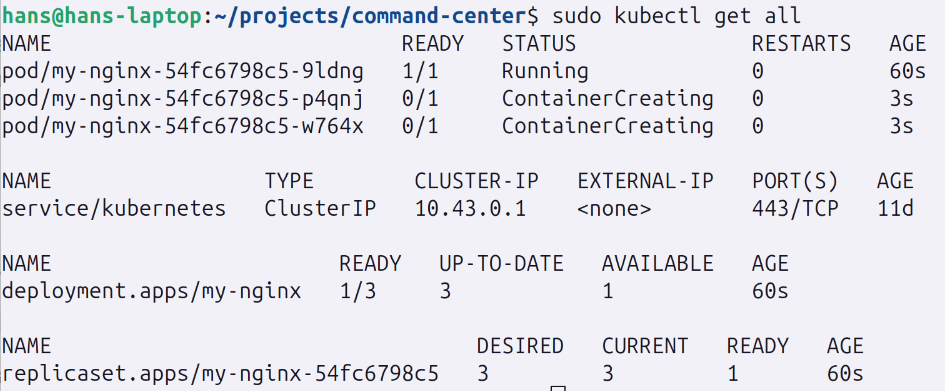

# Kubernetes

[Kubectl quick reference](https://kubernetes.io/docs/reference/kubectl/quick-reference/)

[Kubectl for Docker Users](https://kubernetes.io/docs/reference/kubectl/docker-cli-to-kubectl/)

[Kubernetes cheatsheet](https://cheatography.com/gauravpandey44/cheat-sheets/kubernetes-k8s/)

## Introduction

Kubernetes is a popular container orchestration system.

A container orchestrator is software that makes many servers behave like a single system. Instead of managing containers on individual machines, you describe what you want (the desired state), and Kubernetes works continuously to make that happen.

Kubernetes can run on different backends and environments:
* On your local machine 
* On bare metal servers 
* On virtual machines 
* On cloud providers (managed Kubernetes)

Kubernetes does not require Docker specifically.
Today, Kubernetes uses the Container Runtime Interface (CRI) and commonly runs containers via containerd or CRI-O. Docker used to be common, but it is no longer required.

Kubernetes exposes:
* A REST API (the core of the system)
* A CLI (`kubectl`) that talks to this API

Managing containers and workloads through this API is often referred to as cluster control or control plane interaction.

Most major cloud providers offer managed Kubernetes services, where they operate the control plane for you.

Just like Linux, Kubernetes has many distributions (e.g., k3s, MicroK8s, OpenShift), which bundle Kubernetes with tooling and sensible defaults.

---

## Why Kubernetes?

Not every project needs Kubernetes.

Whether Kubernetes makes sense depends on:
* How many servers you run 
* How often workloads change 
* How much automation and resilience you need 
* Team size and operational complexity

Kubernetes is most valuable when you need:
* High availability 
* Automated scheduling 
* Self-healing workloads 
* Scaling across multiple nodes 
* Consistent deployments

When you choose Kubernetes, you also choose a distribution.

Things to consider when choosing a distribution:
* Ease of installation 
* Built-in components (ingress, storage, networking)
* Resource usage 
* Production vs learning focus

You can run pure upstream Kubernetes, but most of the time you don’t need to.

Distributions exist because they:
* Reduce setup complexity
* Provide better defaults 
* Get you productive faster

## Terminology

* Kubernetes 
  * The full container orchestration system 
  * Often abbreviated as K8s (“k-eights”) or Kube
* kubectl 
  * Command-line interface for interacting with Kubernetes 
  * Talks to the Kubernetes API server 
  * Pronounced informally as “cube control”, “kubectl”, etc.
* Cluster 
  * A group of machines (nodes) managed by Kubernetes
* Node 
  * A single machine (VM or physical) in the cluster 
  * Runs workloads (pods)
* Kubelet 
  * The Kubernetes agent running on each node 
  * Responsible for starting and monitoring containers
* Control Plane 
  * Components that manage the cluster as a whole 
  * Sometimes (historically) called the “master” 
  * Responsible for scheduling, state management, and control logic
* Pod 
  * One or more containers that always run together 
  * The smallest deployable unit in Kubernetes
  * Containers never run directly — they always run inside pods
* Controller 
  * A control loop that ensures the cluster matches the desired state 
  * Examples: Deployment controller, ReplicaSet controller, Job controller
* Service 
  * A stable network endpoint for accessing pods 
  * Provides a DNS name and virtual IP 
  * Decouples networking from individual pod lifetimes
* Namespace 
  * A logical partition inside a cluster 
  * Used to group and isolate resources 
  * Also affects what you see when using `kubectl`

---

## High level architecture

Like Docker Swarm, Kubernetes consists of multiple nodes working together.

A Kubernetes cluster is split into:
* Control plane nodes 
* Worker nodes

### Control Plane

The control plane manages the cluster’s state.

In production, the control plane often runs on multiple nodes (usually an odd number like 3 or 5) to maintain etcd quorum and fault tolerance.

Core control plane components include:
* etcd 
  * Distributed key-value store 
  * Stores all cluster state (desired + current)
* API Server 
  * The front door to Kubernetes 
  * All commands and components talk through this API
* Scheduler
  * Decides where new pods should run 
  * Considers resource usage, constraints, and policies
* Controller Manager 
  * Runs controllers that reconcile desired vs actual state 
  * Example: ensuring 3 replicas exist if you asked for 3
* CoreDNS
  * Provides internal DNS for services and pods

Depending on the distribution, additional components may run here as well.

---

### Worker Nodes

Worker nodes are where workloads actually run.

Each worker node runs:
* Kubelet 
  * Communicates with the API server 
  * Starts and monitors pods on the node
* kube-proxy 
  * Handles networking rules 
  * Enables services and load balancing
* Container Runtime 
  * Typically `containerd` 
  * Responsible for running containers


---

## Installation

Because Kubernetes has many distributions, there are many installation options.

For learning purposes, it’s best to choose the simplest setup for your environment:

* Docker Desktop 
  * Enable Kubernetes in settings 
  * Very easy, but somewhat abstracted
* Minikube 
  * Runs Kubernetes inside a VM or container 
  * Good cross-platform learning option
* Linux
  * k3s 
  * Lightweight, fast, and close to real-world Kubernetes 
  * Ideal for learning on Linux

For this tutorial, we will use [K3s](https://docs.k3s.io/quick-start).

---

## Why do pods exist?

Pods are a Kubernetes concept that is unique to Kubernetes.

A Pod is the smallest unit that Kubernetes can create and manage.
It is a layer of abstraction above containers.

A pod:
* Wraps one or more containers
* Shares:
  * the same IP address 
  * the same network namespace 
  * the same storage volumes 
  * the same lifecycle (start, stop, restart)
* Is scheduled onto a single node

In practice, most pods contain one container, but multi-container pods are used for:
* sidecars (logging, proxies, monitoring agents)
* tightly coupled processes that must run together

Unlike Docker, you cannot create containers directly in Kubernetes.

Instead, you create pods, and Kubernetes creates the containers inside them.

You can create pods via:
* CLI (kubectl)
* YAML manifests 
* Kubernetes API

Internally, the process looks like this:
1. You request a pod via the Kubernetes API. 
2. The API server stores the desired state in etcd. 
3. The scheduler chooses a node for the pod. 
4. The kubelet on that node tells the container runtime (containerd, CRI-O, etc.) to start the containers.

Important mental model:

>Kubernetes does not manage containers directly.
>
> Kubernetes manages pods. Pods are implemented using containers.

More precisely:
* Container runtimes do not know about pods
* kubelet knows about both pods and container runtimes
* kubelet translates pod definitions into container runtime instructions

So the chain of responsibility is:
```text
kubectl → API server → etcd → scheduler → kubelet → container runtime → containers
```

Every higher-level Kubernetes resource (Deployments, Jobs, DaemonSets, etc.) ultimately creates pods.


---

## Kubectl

Kubernetes is not opinionated about workflows, so there are multiple ways to create resources.

Common ways to create pods and other resources:
* `kubectl run`
  * Creates a single pod directly 
  * Roughly comparable to docker run 
  * Mostly used for quick experiments
* `kubectl create`
  * Creates resources via CLI flags or YAML 
  * Similar in spirit to Docker Swarm commands
* `kubectl apply`
  * Declarative approach using YAML 
  * Used for real-world Kubernetes workflows 
  * Can create or update resources

---

## Checking kubectl

First, verify that kubectl is working:

```bash
kubectl version
```

If your cluster is running, you should see both client and server versions.

---

## Creating a Pod

Let’s create a simple pod running nginx:

```bash
kubectl run my-nginx --image=nginx
```

Unlike Docker, Kubernetes requires a name for the pod.

Important detail:

The command does not mean the pod is already running.
It means the desired state has been recorded in Kubernetes.

Kubernetes will now try to make reality match that desired state.

Check pods:

```bash
kubectl get pods
```


You may see statuses like:

* `Pending` → pod is being scheduled 
* `ContainerCreating` → containers are being started 
* `Running` → pod is ready 
* `CrashLoopBackOff` → container keeps failing

---

## Deleting the Pod

To remove the pod:
```bash
kubectl delete pod my-nginx
```

---

## From Pods to Deployments

Creating pods manually is useful for learning, but it is rarely used in production.

In real Kubernetes usage, you almost always create higher-level resources, such as:
* Deployments 
* StatefulSets 
* Jobs 
* DaemonSets

The most common one is a Deployment.

A Deployment describes:
* what image to run 
* how many replicas (copies) to maintain 
* how updates should happen

Example deployment creation:
```bash
kubectl create deployment my-nginx --image=nginx
```

PS! You don't have to type out `deployment`, you can shorten it as `deploy`.

Now check resources:
```bash
kubectl get all
```


You will see something like:
* Deployment
* ReplicaSet
* Pod(s)

---

## Deleting the Deployment

To remove the deployment:
```bash
kubectl delete deployment my-nginx
```

---

## What is actually happening? (Important Part)

This is the key Kubernetes control flow.

When you create a Deployment, Kubernetes does NOT directly create pods.

Instead, it creates a chain of resources:

### 1) You create a Deployment

You tell Kubernetes:

> “I want nginx running, and I want 1 replica.”

This is stored in etcd as the desired state.

### 2) The Deployment controller reacts

The Deployment controller sees the new Deployment and decides:

> “To satisfy this Deployment, I need a ReplicaSet.”

So Kubernetes creates a ReplicaSet.

### 3) The ReplicaSet controller reacts

The ReplicaSet says:

> “I must ensure there are N pods running.”

If you asked for 1 replica, it creates 1 pod.
If you asked for 3 replicas, it creates 3 pods.

So the ReplicaSet creates Pods.

### 4) The Scheduler assigns Pods to Nodes

The scheduler chooses which node each pod should run on.

### 5) kubelet creates Containers

On each chosen node:
* kubelet receives the pod specification
* kubelet tells the container runtime to start the containers

Now your application is actually running.

---

### Visual Summary
```text
Deployment
↓
ReplicaSet
↓
Pod
↓
Container(s)
```

Or in words:

> Deployments manage ReplicaSets.
>
> ReplicaSets manage Pods.
>
> Pods contain Containers.

---

### Why is it designed like this?

This layered design enables powerful features:

#### Rolling Updates

When you update a Deployment:
* Kubernetes creates a new ReplicaSet with the new version
* Gradually scales up new pods and scales down old ones
* This is how zero-downtime deployments work

#### Self-Healing

If a pod crashes:
* ReplicaSet notices fewer pods than desired
* Automatically creates a new pod

#### Scaling

If you scale a Deployment:
```bash
kubectl scale deployment my-nginx --replicas=3
````
* ReplicaSet creates 2 additional pods

The pods won't be up instantly once the command is run:



Note the naming:
* A deployment is generated with the name `my-nginx`
  * `deployment.apps/my-nginx`
* This creates a ReplicaSet with the same name and a unique identifier appended
  * `replicaset.apps/my-nginx-54fc6798c5`
  * Appended **-54fc6798c5**
  * The hash that's appended is from the pod template
* Followed by pods being created using the generated ReplicaSet name with random identifiers appended
  * `pod/my-nginx-54fc6798c5-9ldng`
    * Appended **-9ldng**
  * `pod/my-nginx-54fc6798c5-p4qnj`
    * Appended **-p4qnj**
  * `pod/my-nginx-54fc6798c5-w764x`
    * Appended **-w764x**

#### What happens when we scale
1. The desired state is updated declaratively
   * “This is what I want to be present.”
2. `kubectl` updates the Deployment via the API server.
3. The Deployment controller sees that only the replica count changed
   * No new ReplicaSet is created
   * A new ReplicaSet would only be created if the pod template changed (image, env vars, etc).
4. The Deployment controller updates the ReplicaSet’s desired replica count. 
5. The ReplicaSet controller creates new Pod objects. 
6. The Scheduler assigns each new Pod to a node. 
7. kubelet on each node notices assigned Pods. 
8. kubelet instructs the container runtime to start containers.

---

#### Declarative Model

You describe what you want, not how to do it.

Kubernetes constantly reconciles:
````text
desired state ≈ actual state
````

---

### Important Learning Insight

When learning Kubernetes, always ask:

> “Which controller is responsible for this resource?”

Because most of Kubernetes is just controllers reacting to state changes.

---