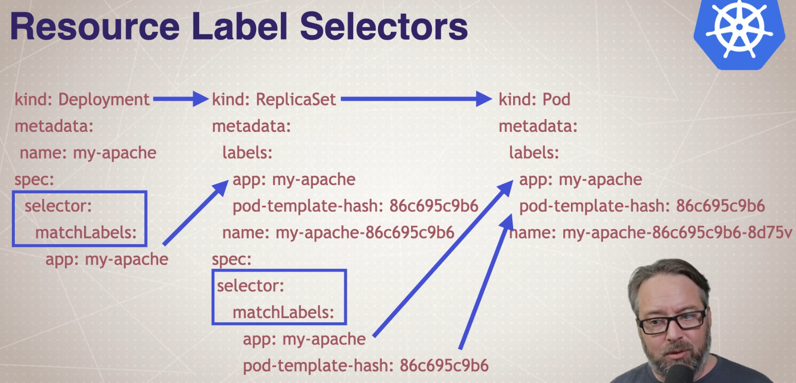

# Inspecting Resources

Create something to inspect:
```bash
kubectl create deployment my-apache --image httpd --replicas 2
```

This creates the chain:
```text
Deployment → ReplicaSet → Pods → Containers
```

---

## The Resource Relationship Map

Deployment → ReplicaSet → Pod
* Deployment owns rollout strategy + desired replicas at a high level 
* ReplicaSet enforces the number of pods 
* Pods are the actual scheduled units that run containers

A typical naming chain looks like:
```text
deployment.apps/my-apache
replicaset.apps/my-apache-5c789d6ff
pod/my-apache-5c789d6ff-krwpx
```

* `5c789d6ff` = pod template hash (changes when the pod template changes: image/env/ports/volumes/etc.)
* pod suffix `krwpx` = random uniqueness

---

### How Resources Connect (Labels + Selectors)



Kubernetes “ownership” is tracked mainly by:
* ownerReferences (real ownership metadata)
* labels/selectors (how controllers find their pods)

Quick rule:
* Deployment selects ReplicaSets
* ReplicaSet selects Pods
* Selection is done by labels

You can see this in -o wide:
```bash
kubectl get deploy/my-apache -o wide
```

Adds:
* container image
* selector labels
* additional scheduling info (for other resources)

```text
NAME        READY   UP-TO-DATE   AVAILABLE   AGE   CONTAINERS   IMAGES   SELECTOR
my-apache   2/2     2            2           30m   httpd        httpd    app=my-apache
```

Look for:
* SELECTOR `app=my-apache`

Then see that the Pods carry the same label:

```bash
kubectl get pods -l app=my-apache --show-labels
```
```text
NAME                        READY   STATUS    RESTARTS   AGE   LABELS
my-apache-5c789d6ff-w79gv   1/1     Running   0          15s   app=my-apache,pod-template-hash=5c789d6ff
my-apache-5c789d6ff-z82xt   1/1     Running   0          15s   app=my-apache,pod-template-hash=5c789d6ff
```

---

### Inspecting each level

#### 1) Deployment level (high level)

```bash
kubectl get deploy my-apache
```

| Column      | Meaning                          |
|-------------|----------------------------------|
| READY       | Pods ready / desired             |
| UP-TO-DATE  | Pods using latest spec           |
| AVAILABLE   | Pods available to serve traffic  |
| AGE         | Resource lifetime                |

```text
NAME        READY   UP-TO-DATE   AVAILABLE   AGE
my-apache   2/2     2            2           30m
```

`describe` gives a holistic debug view (especially events):

```bash
kubectl describe deploy my-apache
```
```text
Name:                   my-apache
Namespace:              default
CreationTimestamp:      Wed, 11 Feb 2026 08:31:45 +0200
Labels:                 app=my-apache
Annotations:            deployment.kubernetes.io/revision: 1
Selector:               app=my-apache
Replicas:               2 desired | 2 updated | 2 total | 2 available | 0 unavailable
StrategyType:           RollingUpdate
MinReadySeconds:        0
RollingUpdateStrategy:  25% max unavailable, 25% max surge
Pod Template:
  Labels:  app=my-apache
  Containers:
   httpd:
    Image:         httpd
    Port:          <none>
    Host Port:     <none>
    Environment:   <none>
    Mounts:        <none>
  Volumes:         <none>
  Node-Selectors:  <none>
  Tolerations:     <none>
Conditions:
  Type           Status  Reason
  ----           ------  ------
  Available      True    MinimumReplicasAvailable
  Progressing    True    NewReplicaSetAvailable
OldReplicaSets:  <none>
NewReplicaSet:   my-apache-5c789d6ff (2/2 replicas created)
Events:
  Type    Reason             Age   From                   Message
  ----    ------             ----  ----                   -------
  Normal  ScalingReplicaSet  12m   deployment-controller  Scaled up replica set my-apache-5c789d6ff from 0 to 2
```

Use this when you want to know:
* is rollout healthy?
* are replicas available?
* which ReplicaSet is active?
* what events happened?

---

#### 2) ReplicaSet level (enforces replica count)

List ReplicaSets:

```bash
kubectl get rs
```

```text
NAME                  DESIRED   CURRENT   READY   AGE
my-apache-5c789d6ff   2         2         2       22m
```

Get the ReplicaSet created by your deployment:
```text
kubectl get rs -l app=my-apache
```

```text
NAME                  DESIRED   CURRENT   READY   AGE
my-apache-5c789d6ff   2         2         2       23m
```

Describe one:
```bash
kubectl describe rs my-apache-5c789d6ff
```

```text
Name:           my-apache-5c789d6ff
Namespace:      default
Selector:       app=my-apache,pod-template-hash=5c789d6ff
Labels:         app=my-apache
                pod-template-hash=5c789d6ff
Annotations:    deployment.kubernetes.io/desired-replicas: 2
                deployment.kubernetes.io/max-replicas: 3
                deployment.kubernetes.io/revision: 1
Controlled By:  Deployment/my-apache
Replicas:       2 current / 2 desired
Pods Status:    2 Running / 0 Waiting / 0 Succeeded / 0 Failed
Pod Template:
  Labels:  app=my-apache
           pod-template-hash=5c789d6ff
  Containers:
   httpd:
    Image:         httpd
    Port:          <none>
    Host Port:     <none>
    Environment:   <none>
    Mounts:        <none>
  Volumes:         <none>
  Node-Selectors:  <none>
  Tolerations:     <none>
Events:
  Type    Reason            Age   From                   Message
  ----    ------            ----  ----                   -------
  Normal  SuccessfulCreate  24m   replicaset-controller  Created pod: my-apache-5c789d6ff-z82xt
  Normal  SuccessfulCreate  24m   replicaset-controller  Created pod: my-apache-5c789d6ff-w79gv
```

Use this to answer:
* is it trying to create pods?
* is it failing to create pods?
* is it creating too many / too few?

---

#### 3) Pod level (where things fail most often)

List pods:
```bash
kubectl get pods
```
```text
NAME                        READY   STATUS    RESTARTS   AGE
my-apache-5c789d6ff-w79gv   1/1     Running   0          25m
my-apache-5c789d6ff-z82xt   1/1     Running   0          25m
```

```bash
kubectl get pods -l app=my-apache
```
```text
NAME                        READY   STATUS    RESTARTS   AGE
my-apache-5c789d6ff-w79gv   1/1     Running   0          26m
my-apache-5c789d6ff-z82xt   1/1     Running   0          26m
```

For more info:
```bash
kubectl get pods -o wide
```

```text
NAME                        READY   STATUS    RESTARTS   AGE   IP           NODE          NOMINATED NODE   READINESS GATES
my-apache-5c789d6ff-w79gv   1/1     Running   0          26m   10.42.0.74   hans-laptop   <none>           <none>
my-apache-5c789d6ff-z82xt   1/1     Running   0          26m   10.42.0.73   hans-laptop   <none>           <none>
```

Key thing from `-o wide`: NODE (where it’s running)

Describe a pod:
```bash
kubectl describe pod my-apache-5c789d6ff-w79gv
```
```text
Name:             my-apache-5c789d6ff-w79gv
Namespace:        default
Priority:         0
Service Account:  default
Node:             hans-laptop/10.225.152.39
Start Time:       Mon, 16 Feb 2026 09:11:39 +0200
Labels:           app=my-apache
                  pod-template-hash=5c789d6ff
Annotations:      <none>
Status:           Running
IP:               10.42.0.74
IPs:
  IP:           10.42.0.74
Controlled By:  ReplicaSet/my-apache-5c789d6ff
Containers:
  httpd:
    Container ID:   containerd://25b4d15ea90bbbbf68c18101a2fb615e77c9f74604112158343be432c8146f98
    Image:          httpd
    Image ID:       docker.io/library/httpd@sha256:b89c19a390514d6767e8c62f29375d0577190be448f63b24f5f11d6b03f7bf18
    Port:           <none>
    Host Port:      <none>
    State:          Running
      Started:      Mon, 16 Feb 2026 09:11:41 +0200
    Ready:          True
    Restart Count:  0
    Environment:    <none>
    Mounts:
      /var/run/secrets/kubernetes.io/serviceaccount from kube-api-access-tcznq (ro)
Conditions:
  Type                        Status
  PodReadyToStartContainers   True 
  Initialized                 True 
  Ready                       True 
  ContainersReady             True 
  PodScheduled                True 
Volumes:
  kube-api-access-tcznq:
    Type:                    Projected (a volume that contains injected data from multiple sources)
    TokenExpirationSeconds:  3607
    ConfigMapName:           kube-root-ca.crt
    Optional:                false
    DownwardAPI:             true
QoS Class:                   BestEffort
Node-Selectors:              <none>
Tolerations:                 node.kubernetes.io/not-ready:NoExecute op=Exists for 300s
                             node.kubernetes.io/unreachable:NoExecute op=Exists for 300s
Events:
  Type    Reason     Age   From               Message
  ----    ------     ----  ----               -------
  Normal  Scheduled  28m   default-scheduler  Successfully assigned default/my-apache-5c789d6ff-w79gv to hans-laptop
  Normal  Pulling    28m   kubelet            Pulling image "httpd"
  Normal  Pulled     28m   kubelet            Successfully pulled image "httpd" in 1.199s (1.199s including waiting). Image size: 45240469 bytes.
  Normal  Created    28m   kubelet            Created container: httpd
  Normal  Started    28m   kubelet            Started container httpd
```

This is the best command when:
* the pod is Pending
* it’s CrashLoopBackOff
* it won’t start
* it won’t pull an image

The bottom of `describe` includes Events.

---

### YAML Output (Full Resource Definition)

This prints the full API object stored in Kubernetes.

```bash
kubectl get deploy/my-apache -o yaml
```
```yaml
apiVersion: apps/v1
kind: Deployment
metadata:
  annotations:
    deployment.kubernetes.io/revision: "1"
  creationTimestamp: "2026-02-11T06:31:45Z"
  generation: 1
  labels:
    app: my-apache
  name: my-apache
  namespace: default
  resourceVersion: "215312"
  uid: 32498e48-ffec-47e5-baa6-eafc14c1c3cb
spec:
  progressDeadlineSeconds: 600
  replicas: 2
  revisionHistoryLimit: 10
  selector:
    matchLabels:
      app: my-apache
  strategy:
    rollingUpdate:
      maxSurge: 25%
      maxUnavailable: 25%
    type: RollingUpdate
  template:
    metadata:
      labels:
        app: my-apache
    spec:
      containers:
      - image: httpd
        imagePullPolicy: Always
        name: httpd
        resources: {}
        terminationMessagePath: /dev/termination-log
        terminationMessagePolicy: File
      dnsPolicy: ClusterFirst
      restartPolicy: Always
      schedulerName: default-scheduler
      securityContext: {}
      terminationGracePeriodSeconds: 30
status:
  availableReplicas: 2
  conditions:
  - lastTransitionTime: "2026-02-11T06:31:51Z"
    lastUpdateTime: "2026-02-11T06:31:51Z"
    message: Deployment has minimum availability.
    reason: MinimumReplicasAvailable
    status: "True"
    type: Available
  - lastTransitionTime: "2026-02-11T06:31:45Z"
    lastUpdateTime: "2026-02-11T06:31:51Z"
    message: ReplicaSet "my-apache-5c789d6ff" has successfully progressed.
    reason: NewReplicaSetAvailable
    status: "True"
    type: Progressing
  observedGeneration: 1
  readyReplicas: 2
  replicas: 2
  updatedReplicas: 2
```

Important mental split:
```text
spec   = desired state
status = actual state
```

Why it’s useful:
* confirms exactly what Kubernetes thinks the config is
* lets you see selectors/labels/ownerReferences clearly
* good for “something subtle is wrong” debugging

---

### The Debugging Workflow (Do This Order)

When something doesn’t work, follow this exact flow:

---

#### Step 1: “What’s broken?”

```bash
kubectl get deploy,rs,pods
```

Look for:
* READY < desired
* pods stuck in `Pending`
* `CrashLoopBackOff`
* `ImagePullBackOff`

---

#### Step 2: “Why is it broken?”

Pick a failing pod and run:

````bash
kubectl describe pod <pod-name>
````

Focus on:
* Status
* Conditions
* Events (bottom)

Events are usually the fastest explanation.

---

#### Step 3: “Is it scheduling or startup?”

Interpret the common cases:

##### If pod is Pending
Likely scheduling issue:
* no resources
* node taints
* constraints (selectors/affinity)
* missing volumes

Look for events like:
* “FailedScheduling”

##### If pod is ContainerCreating
Usually:
* image pull in progress
* volumes mounting
* CNI networking

##### If pod is ImagePullBackOff
Image name, registry auth, DNS, network.

##### If pod is CrashLoopBackOff
Container starts then crashes repeatedly.

Now you move to logs.

---

### Step 4: “What did the container say?”

Get logs:

````bash
kubectl logs <pod-name>
````

If the pod has multiple containers:
````bash
kubectl logs <pod-name> -c <container-name>
````

If the pod keeps restarting, view the previous crash:

````bash
kubectl logs <pod-name> --previous
````

This is very common in CrashLoopBackOff debugging.

---

### Step 5: “Can I see it live?”

Stream logs:
```bash
kubectl logs -f <pod-name>
```
---

### Step 6: “If logs are not enough, inspect inside”

Open a shell in the container:
```bash
kubectl exec -it <pod-name> -- sh
```

(or bash if available)

Use this if you need to check:
* config files 
* network connectivity 
* environment variables 
* filesystem / mounted volumes

---

### Events: Cluster-wide and Live

Events are their own resource.

Cluster-wide:
```bash
kubectl get events
```

```text
LAST SEEN   TYPE      REASON                           OBJECT                           MESSAGE
9h          Normal    NodeNotReady                     node/hans-laptop                 Node hans-laptop status is now: NodeNotReady
53m         Normal    CertificateExpirationOK          node/hans-laptop                 Node and Certificate Authority certificates managed by k3s are OK
53m         Normal    Starting                         node/hans-laptop                 Starting kubelet.
53m         Warning   SystemOOM                        node/hans-laptop                 System OOM encountered, victim process: nginx, pid: 9295
53m         Warning   SystemOOM                        node/hans-laptop                 System OOM encountered, victim process: coredns, pid: 478970
53m         Warning   InvalidDiskCapacity              node/hans-laptop                 invalid capacity 0 on image filesystem
53m         Warning   SystemOOM                        node/hans-laptop                 System OOM encountered, victim process: chrome, pid: 343134
53m         Normal    NodeAllocatableEnforced          node/hans-laptop                 Updated Node Allocatable limit across pods
53m         Normal    NodeHasSufficientMemory          node/hans-laptop                 Node hans-laptop status is now: NodeHasSufficientMemory
53m         Normal    NodeHasNoDiskPressure            node/hans-laptop                 Node hans-laptop status is now: NodeHasNoDiskPressure
53m         Normal    NodeHasSufficientPID             node/hans-laptop                 Node hans-laptop status is now: NodeHasSufficientPID
53m         Normal    NodeReady                        node/hans-laptop                 Node hans-laptop status is now: NodeReady
53m         Normal    Starting                         node/hans-laptop                 
53m         Normal    RegisteredNode                   node/hans-laptop                 Node hans-laptop event: Registered Node hans-laptop in Controller
53m         Normal    NodePasswordValidationComplete   node/hans-laptop                 Deferred node password secret validation complete
48m         Normal    CertificateExpirationOK          node/hans-laptop                 Node and Certificate Authority certificates managed by k3s are OK
48m         Normal    Starting                         node/hans-laptop                 Starting kubelet.
48m         Warning   InvalidDiskCapacity              node/hans-laptop                 invalid capacity 0 on image filesystem
48m         Normal    NodeAllocatableEnforced          node/hans-laptop                 Updated Node Allocatable limit across pods
48m         Normal    Starting                         node/hans-laptop                 
48m         Normal    NodeHasSufficientMemory          node/hans-laptop                 Node hans-laptop status is now: NodeHasSufficientMemory
48m         Normal    NodeHasNoDiskPressure            node/hans-laptop                 Node hans-laptop status is now: NodeHasNoDiskPressure
48m         Normal    NodeHasSufficientPID             node/hans-laptop                 Node hans-laptop status is now: NodeHasSufficientPID
48m         Warning   Rebooted                         node/hans-laptop                 Node hans-laptop has been rebooted, boot id: 3db5542f-7e13-4fac-b717-5c41b0d2e35b
48m         Normal    RegisteredNode                   node/hans-laptop                 Node hans-laptop event: Registered Node hans-laptop in Controller
48m         Normal    NodePasswordValidationComplete   node/hans-laptop                 Deferred node password secret validation complete
27m         Normal    Scheduled                        pod/my-apache-5c789d6ff-g8jvd    Successfully assigned default/my-apache-5c789d6ff-g8jvd to hans-laptop
27m         Normal    Pulling                          pod/my-apache-5c789d6ff-g8jvd    Pulling image "httpd"
26m         Normal    Pulled                           pod/my-apache-5c789d6ff-g8jvd    Successfully pulled image "httpd" in 4.557s (4.557s including waiting). Image size: 45240469 bytes.
26m         Normal    Created                          pod/my-apache-5c789d6ff-g8jvd    Created container: httpd
26m         Normal    Started                          pod/my-apache-5c789d6ff-g8jvd    Started container httpd
27m         Normal    Scheduled                        pod/my-apache-5c789d6ff-krwpx    Successfully assigned default/my-apache-5c789d6ff-krwpx to hans-laptop
27m         Normal    Pulling                          pod/my-apache-5c789d6ff-krwpx    Pulling image "httpd"
26m         Normal    Pulled                           pod/my-apache-5c789d6ff-krwpx    Successfully pulled image "httpd" in 4.554s (4.554s including waiting). Image size: 45240469 bytes.
26m         Normal    Created                          pod/my-apache-5c789d6ff-krwpx    Created container: httpd
26m         Normal    Started                          pod/my-apache-5c789d6ff-krwpx    Started container httpd
2m14s       Normal    Killing                          pod/my-apache-5c789d6ff-krwpx    Stopping container httpd
2m13s       Normal    Scheduled                        pod/my-apache-5c789d6ff-v4clv    Successfully assigned default/my-apache-5c789d6ff-v4clv to hans-laptop
2m14s       Normal    Pulling                          pod/my-apache-5c789d6ff-v4clv    Pulling image "httpd"
2m13s       Normal    Pulled                           pod/my-apache-5c789d6ff-v4clv    Successfully pulled image "httpd" in 859ms (859ms including waiting). Image size: 45240469 bytes.
2m13s       Normal    Created                          pod/my-apache-5c789d6ff-v4clv    Created container: httpd
2m13s       Normal    Started                          pod/my-apache-5c789d6ff-v4clv    Started container httpd
27m         Normal    SuccessfulCreate                 replicaset/my-apache-5c789d6ff   Created pod: my-apache-5c789d6ff-krwpx
27m         Normal    SuccessfulCreate                 replicaset/my-apache-5c789d6ff   Created pod: my-apache-5c789d6ff-g8jvd
2m14s       Normal    SuccessfulCreate                 replicaset/my-apache-5c789d6ff   Created pod: my-apache-5c789d6ff-v4clv
27m         Normal    ScalingReplicaSet                deployment/my-apache             Scaled up replica set my-apache-5c789d6ff from 0 to 2
9h          Warning   NodeNotReady                     pod/my-nginx-54fc6798c5-9ldng    Node is not ready
51m         Normal    Pulling                          pod/my-nginx-54fc6798c5-9ldng    Pulling image "nginx"
53m         Normal    TaintManagerEviction             pod/my-nginx-54fc6798c5-9ldng    Cancelling deletion of Pod default/my-nginx-54fc6798c5-9ldng
51m         Warning   Failed                           pod/my-nginx-54fc6798c5-9ldng    Failed to pull image "nginx": failed to pull and unpack image "docker.io/library/nginx:latest": failed to resolve reference "docker.io/library/nginx:latest": failed to do request: Head "https://registry-1.docker.io/v2/library/nginx/manifests/latest": dial tcp: lookup registry-1.docker.io: Try again
51m         Warning   Failed                           pod/my-nginx-54fc6798c5-9ldng    Error: ErrImagePull
52m         Normal    BackOff                          pod/my-nginx-54fc6798c5-9ldng    Back-off pulling image "nginx"
52m         Warning   Failed                           pod/my-nginx-54fc6798c5-9ldng    Error: ImagePullBackOff
49m         Warning   BackOff                          pod/my-nginx-54fc6798c5-9ldng    Back-off restarting failed container nginx in pod my-nginx-54fc6798c5-9ldng_default(85857d4c-f5fc-46d2-90ae-71e090d835e9)
48m         Normal    SandboxChanged                   pod/my-nginx-54fc6798c5-9ldng    Pod sandbox changed, it will be killed and re-created.
48m         Normal    Pulling                          pod/my-nginx-54fc6798c5-9ldng    Pulling image "nginx"
48m         Normal    Pulled                           pod/my-nginx-54fc6798c5-9ldng    Successfully pulled image "nginx" in 890ms (890ms including waiting). Image size: 62939286 bytes.
48m         Normal    Created                          pod/my-nginx-54fc6798c5-9ldng    Created container: nginx
48m         Normal    Started                          pod/my-nginx-54fc6798c5-9ldng    Started container nginx
9h          Warning   NodeNotReady                     pod/my-nginx-54fc6798c5-p4qnj    Node is not ready
51m         Normal    Pulling                          pod/my-nginx-54fc6798c5-p4qnj    Pulling image "nginx"
53m         Normal    TaintManagerEviction             pod/my-nginx-54fc6798c5-p4qnj    Cancelling deletion of Pod default/my-nginx-54fc6798c5-p4qnj
51m         Warning   Failed                           pod/my-nginx-54fc6798c5-p4qnj    Failed to pull image "nginx": failed to pull and unpack image "docker.io/library/nginx:latest": failed to resolve reference "docker.io/library/nginx:latest": failed to do request: Head "https://registry-1.docker.io/v2/library/nginx/manifests/latest": dial tcp: lookup registry-1.docker.io: Try again
51m         Warning   Failed                           pod/my-nginx-54fc6798c5-p4qnj    Error: ErrImagePull
52m         Normal    BackOff                          pod/my-nginx-54fc6798c5-p4qnj    Back-off pulling image "nginx"
52m         Warning   Failed                           pod/my-nginx-54fc6798c5-p4qnj    Error: ImagePullBackOff
49m         Warning   BackOff                          pod/my-nginx-54fc6798c5-p4qnj    Back-off restarting failed container nginx in pod my-nginx-54fc6798c5-p4qnj_default(a4d75ab6-b44d-4bd7-bc0c-164dcee517d1)
48m         Normal    SandboxChanged                   pod/my-nginx-54fc6798c5-p4qnj    Pod sandbox changed, it will be killed and re-created.
48m         Normal    Pulling                          pod/my-nginx-54fc6798c5-p4qnj    Pulling image "nginx"
48m         Normal    Pulled                           pod/my-nginx-54fc6798c5-p4qnj    Successfully pulled image "nginx" in 1.001s (1.001s including waiting). Image size: 62939286 bytes.
48m         Normal    Created                          pod/my-nginx-54fc6798c5-p4qnj    Created container: nginx
48m         Normal    Started                          pod/my-nginx-54fc6798c5-p4qnj    Started container nginx
9h          Warning   NodeNotReady                     pod/my-nginx-54fc6798c5-w764x    Node is not ready
52m         Normal    Pulling                          pod/my-nginx-54fc6798c5-w764x    Pulling image "nginx"
53m         Normal    TaintManagerEviction             pod/my-nginx-54fc6798c5-w764x    Cancelling deletion of Pod default/my-nginx-54fc6798c5-w764x
52m         Warning   Failed                           pod/my-nginx-54fc6798c5-w764x    Failed to pull image "nginx": failed to pull and unpack image "docker.io/library/nginx:latest": failed to resolve reference "docker.io/library/nginx:latest": failed to do request: Head "https://registry-1.docker.io/v2/library/nginx/manifests/latest": dial tcp: lookup registry-1.docker.io: Try again
52m         Warning   Failed                           pod/my-nginx-54fc6798c5-w764x    Error: ErrImagePull
51m         Normal    BackOff                          pod/my-nginx-54fc6798c5-w764x    Back-off pulling image "nginx"
51m         Warning   Failed                           pod/my-nginx-54fc6798c5-w764x    Error: ImagePullBackOff
49m         Warning   BackOff                          pod/my-nginx-54fc6798c5-w764x    Back-off restarting failed container nginx in pod my-nginx-54fc6798c5-w764x_default(fc157f52-6c3f-4ca9-9f3d-77a6402b3d53)
48m         Normal    SandboxChanged                   pod/my-nginx-54fc6798c5-w764x    Pod sandbox changed, it will be killed and re-created.
48m         Normal    Pulling                          pod/my-nginx-54fc6798c5-w764x    Pulling image "nginx"
48m         Normal    Pulled                           pod/my-nginx-54fc6798c5-w764x    Successfully pulled image "nginx" in 854ms (854ms including waiting). Image size: 62939286 bytes.
48m         Normal    Created                          pod/my-nginx-54fc6798c5-w764x    Created container: nginx
48m         Normal    Started                          pod/my-nginx-54fc6798c5-w764x    Started container nginx
```

Live stream:
```bash
kubectl get events --watch-only
```

Output after deleting a pod:
```text
LAST SEEN   TYPE     REASON             OBJECT                           MESSAGE
0s          Normal   Killing            pod/my-apache-5c789d6ff-v4clv    Stopping container httpd
0s          Normal   SuccessfulCreate   replicaset/my-apache-5c789d6ff   Created pod: my-apache-5c789d6ff-8vm5x
0s          Normal   Scheduled          pod/my-apache-5c789d6ff-8vm5x    Successfully assigned default/my-apache-5c789d6ff-8vm5x to hans-laptop
0s          Normal   Pulling            pod/my-apache-5c789d6ff-8vm5x    Pulling image "httpd"
0s          Normal   Pulled             pod/my-apache-5c789d6ff-8vm5x    Successfully pulled image "httpd" in 949ms (949ms including waiting). Image size: 45240469 bytes.
0s          Normal   Created            pod/my-apache-5c789d6ff-8vm5x    Created container: httpd
0s          Normal   Started            pod/my-apache-5c789d6ff-8vm5x    Started container httpd
```

Great for watching what happens when you delete a pod, scale, or deploy.

---

### Watch Mode (Seeing Reconciliation)

Stream pod changes:

```bash
kubectl get pods -w
```

This shows lifecycle transitions, like:
* Terminating 
* Pending 
* ContainerCreating 
* Running

This is different from Linux watch:
* `kubectl -w` streams event changes
* `watch` repeats snapshots

---

### Logs and Where They Come From

Important mental model:
* Logs are stored on the node where the pod runs
* When you run `kubectl logs`, Kubernetes asks the kubelet on that node to fetch logs from the container runtime and return them.

Flow:
```text
kubectl → API server → kubelet (node) → container runtime → logs
```

---

#### Logs for all replicas (label selector)
```bash
kubectl logs -l app=my-apache
```
Important:
* output is not merged chronologically
* it prints one pod’s logs, then the next

```text
AH00558: httpd: Could not reliably determine the server's fully qualified domain name, using 10.42.0.71. Set the 'ServerName' directive globally to suppress this message
AH00558: httpd: Could not reliably determine the server's fully qualified domain name, using 10.42.0.71. Set the 'ServerName' directive globally to suppress this message
[Mon Feb 16 06:37:34.960048 2026] [mpm_event:notice] [pid 1:tid 1] AH00489: Apache/2.4.66 (Unix) configured -- resuming normal operations
[Mon Feb 16 06:37:34.961968 2026] [core:notice] [pid 1:tid 1] AH00094: Command line: 'httpd -D FOREGROUND'
// -> NOTICE HOW IT REPEATS IT AGAIN
AH00558: httpd: Could not reliably determine the server's fully qualified domain name, using 10.42.0.72. Set the 'ServerName' directive globally to suppress this message
AH00558: httpd: Could not reliably determine the server's fully qualified domain name, using 10.42.0.72. Set the 'ServerName' directive globally to suppress this message
[Mon Feb 16 06:37:34.965511 2026] [mpm_event:notice] [pid 1:tid 1] AH00489: Apache/2.4.66 (Unix) configured -- resuming normal operations
[Mon Feb 16 06:37:34.965726 2026] [core:notice] [pid 1:tid 1] AH00094: Command line: 'httpd -D FOREGROUND'
```

---

#### Logs from a Deployment (important behavior)

```bash
kubectl logs deployment/my-apache
```

This chooses one pod automatically.

It does not aggregate logs across replicas.

```text
Found 2 pods, using pod/my-apache-5c789d6ff-w79gv
AH00558: httpd: Could not reliably determine the server's fully qualified domain name, using 10.42.0.74. Set the 'ServerName' directive globally to suppress this message
AH00558: httpd: Could not reliably determine the server's fully qualified domain name, using 10.42.0.74. Set the 'ServerName' directive globally to suppress this message
[Mon Feb 16 07:11:41.093474 2026] [mpm_event:notice] [pid 1:tid 1] AH00489: Apache/2.4.66 (Unix) configured -- resuming normal operations
[Mon Feb 16 07:11:41.093690 2026] [core:notice] [pid 1:tid 1] AH00094: Command line: 'httpd -D FOREGROUND'
```

---

#### Multi-container Pods

To find container names:
```bash
kubectl describe pod <pod-name>
```

You'll see a containers section in the output:
```yaml
Containers:
  httpd:
    Container ID:   containerd://d1318b1627d4bb19af2748d9bfaac72ef9d69b1416730a23263067af7feeba14
    Image:          httpd
    Image ID:       docker.io/library/httpd@sha256:b89c19a390514d6767e8c62f29375d0577190be448f63b24f5f11d6b03f7bf18
    Port:           <none>
    Host Port:      <none>
    State:          Running
      Started:      Mon, 16 Feb 2026 08:37:34 +0200
    Ready:          True
    Restart Count:  0
    Environment:    <none>
    Mounts:
      /var/run/secrets/kubernetes.io/serviceaccount from kube-api-access-psgzt (ro)
```

Then logs for a specific container:
```bash
kubectl logs <pod-name> -c <container-name>
```

If you want logs from all containers in a pod:
```bash
kubectl logs <pod-name> --all-containers=true
```

---

### “What connects to what?” Quick Cheat Sheet

| You want to inspect…     | Start with…            | Then go to…                        |
|--------------------------|------------------------|------------------------------------|
| rollout health           | `kubectl get deploy`   | `kubectl describe deploy`          |
| replica creation         | `kubectl get rs`       | `kubectl describe rs`              |
| pod stuck/failing        | `kubectl get pods`     | `kubectl describe pod`             |
| why a pod won’t schedule | `describe pod` events  | `describe node` if needed          |
| app crashes              | `kubectl logs`         | `logs --previous`, then `exec`     |
| what changed over time   | `kubectl get pods -w`  | `kubectl get events --watch-only`  |

---

### Two Key Debugging Truths

1. Describe + Events usually tells you why something failed.
2. Logs tell you what the application did (or why it crashed).

---

### Helper tool: Stern

Stern is a CLI that tails logs from multiple pods and can follow patterns:
* much nicer for “all replicas” log viewing
* good for label-based streaming

Tool: [Stern](https://github.com/stern/stern)

Still: in production you usually ship logs to a centralized system (Loki/ELK/etc.)
