# Docker Swarm Guide

This section looks at how to enable Docker Swarm and what do the steps do.

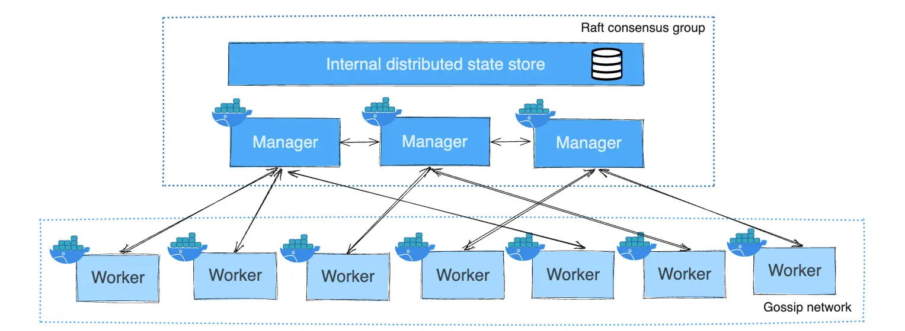

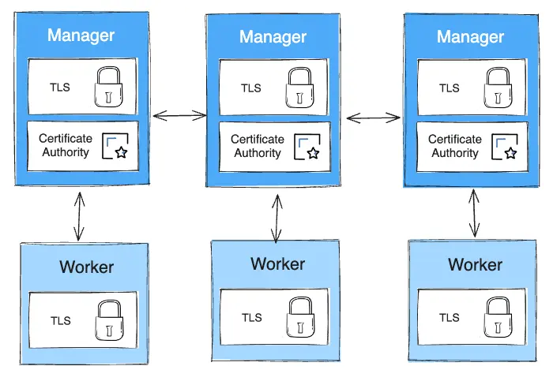

The example below will be using 3 machines.

The environment used: https://labs.play-with-docker.com/

## 1) Pick one machine to become the first manager

On the machine you choose as the manager:

```bash
docker swarm init
```
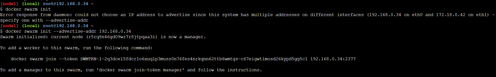

This creates the swarm and makes that node a manager.

Then get join commands for the other machines:

```bash
docker swarm join-token worker
docker swarm join-token manager
```

---

## 2) Join the other machines to the swarm

On each other machine, run the join command you got (worker is fine to start with):

```bash
docker swarm join --token <token> <manager-ip>:2377
```

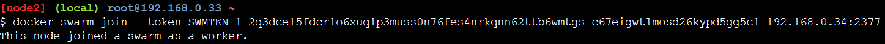

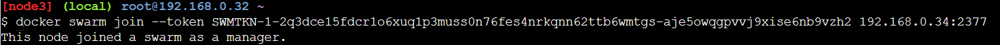

Now you have a cluster.

On the manager, confirm:

```bash
docker node ls
```

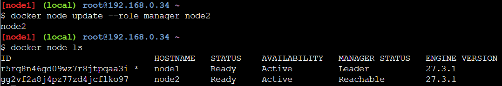

If you want to promote a node that joined as a worker, then you could run:

```bash
docker node update --role manager <node hostname>
```

---


## 3) Create an overlay network

Use an overlay network in order to enable communicating between containers in a swarm.

Without it, there won't be connectivity.

```bash
docker network create -d overlay my-overlay
```

---

## 4) Create a service on a manager machine

```bash
docker service create --replicas 3 --name test-services --network my-overlay busybox ping 8.8.8.8
```

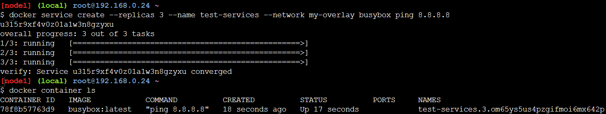

Verify that it's running:

```bash
docker service ls
```

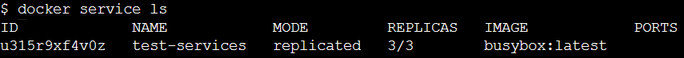

Check that you can see the other containers.

Check what containers are available in the service.

```bash
docker service ps <service reference>
```

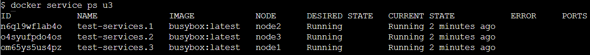

Note that they're running on different nodes.

If you check for containers running on a node, then you'll see that it's going to be corresponding to one of the containers listed.

```bash
docker container ls
```

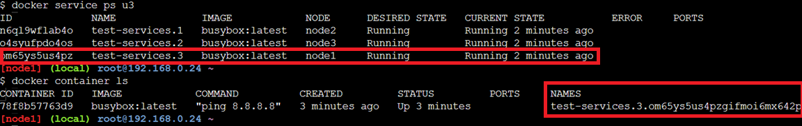

Go into a container to verify connectivity:

```bash
docker exec -it <ref> sh
```

Notice that it uses a long reference as the name - ``<name>.<ID>``

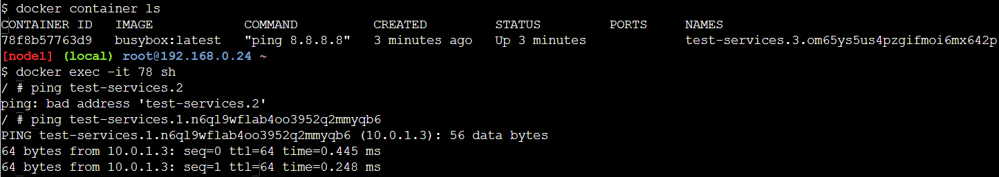

If there'd be no overlay network, then it would not work.

---


