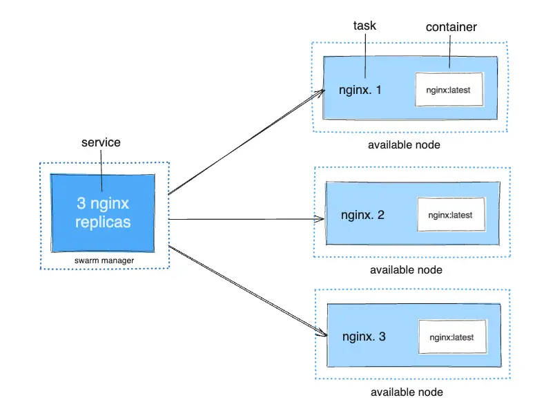
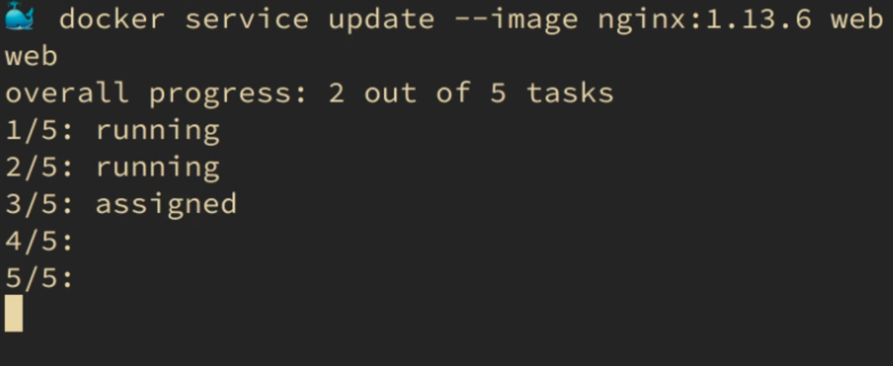
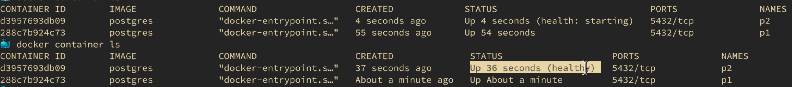
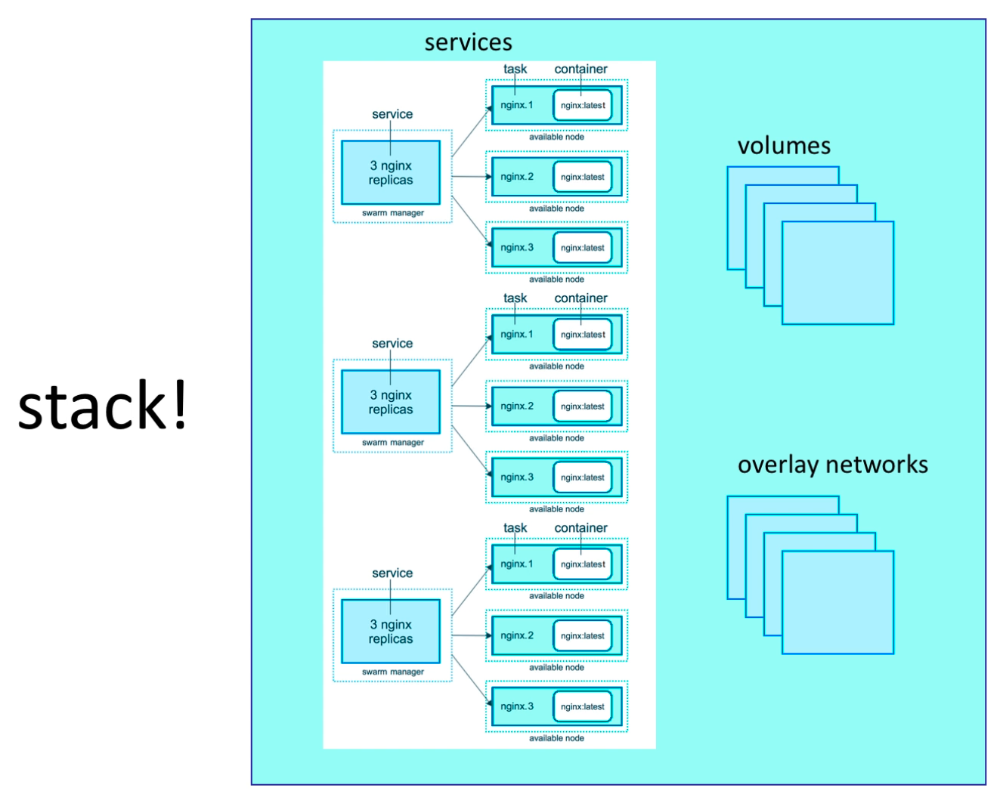

# Docker Swarm Mode

Docker Swarm mode is Docker’s native container orchestration system.
  
It allows you to run Docker containers across multiple machines (nodes) as a single logical cluster.

Swarm mode is built directly into Docker Engine — no extra software is required.

---

## What problem does Swarm solve?

Running containers on a single machine is easy.

Running containers across multiple machines introduces problems that cannot be solved manually at scale:
- How do containers find each other?
- What happens if a machine goes down?
- How do you scale services?
- How do you deploy updates without downtime?
- How do you keep the system in a healthy state?

Docker Swarm solves these problems by providing:
- clustering
- scheduling
- service discovery
- load balancing
- rolling updates
- fault tolerance

The key shift is automation: you describe what you want, and Swarm continuously works to maintain it.

---

## Swarm vs standalone Docker

| Standalone Docker          | Docker Swarm                  |
|----------------------------|-------------------------------|
| Single host                | Multiple hosts                |
| `docker run`               | `docker service`              |
| Manual container placement | Scheduler-based placement     |
| No built-in HA             | Built-in high availability    |
| Containers                 | Services → tasks → containers |

Swarm operates at the service level, not the container level.

This means:
- You stop thinking about individual containers
- Containers become an implementation detail
- You reason about *desired behavior*, not process IDs

This abstraction is essential — manually tracking containers across machines would be unmanageable.

---

## Core concepts and mental model

Before diving into commands, it’s important to understand how Swarm thinks.

### Cluster

A cluster is a group of machines running Docker in Swarm mode that act as a single system.

You interact with the cluster as if it were one Docker host.

A Swarm cluster consists of nodes.

---

### Nodes

A node is a machine in the cluster.

Each node runs:
- Docker Engine
- Swarm components (inside the Docker daemon)

There is no separate “Swarm server”.

---

### Node types

#### Manager nodes
Managers are responsible for decision-making:
- Maintain cluster state
- Schedule services
- Handle orchestration decisions
- Participate in Raft consensus

Managers are the *brain* of the cluster.

#### Worker nodes
Workers are responsible for execution:
- Run containers (tasks)
- Do not make scheduling decisions
- Execute work assigned by managers

Workers are the *muscle* of the cluster.

A single-node Swarm is possible, but production Swarms use multiple manager nodes.

Managers *can* run containers, but in larger or production clusters it’s best practice to:
- Reserve managers for control-plane work
- Run workloads on worker nodes only


### Services
A service is a declaration of intent.

It defines:
- which image to run
- how many replicas should exist
- networking configuration
- update strategy
- resource constraints

A service does not directly run containers.

---

### Tasks
A task is a single, concrete unit of work created to satisfy a service.

Key properties:
- One service → many tasks
- Each task usually maps to one container
- Tasks are immutable
- Failed tasks are replaced, not restarted

This immutability simplifies reasoning about cluster state.



---

## Desired state model (how Swarm thinks)

Swarm uses a declarative desired-state model.

You declare:
> “I want 5 replicas of this service.”

Swarm continuously compares:
* Desired state (what you asked for)
* Actual state (what is currently running)

If they differ, Swarm takes action.

Examples:
- A container crashes → task replaced
- A node disappears → tasks rescheduled
- Replica count changes → tasks added/removed

This reconciliation loop is always running.

---

## Creating a Swarm

```bash
docker swarm init
```

This:
* enables Swarm mode
* makes the node a manager
* creates a cluster

Other nodes join using a join token:

```bash
docker swarm join --token <token> <manager-ip>:2377
```

Refer to [this guide](./DockerSwarmGuide.md) for a description of how to create a Swarm.

---

## Services vs containers in practice

In Swarm mode, you generally do not use docker run.

Instead, you create services:
```bash
docker service create \
  --replicas 3 \
  --name test-service \
  busybox ping 8.8.8.8
```

What happens internally:
1. Manager records the service in cluster state
2. Scheduler decides where tasks should run
3. Tasks are assigned to nodes
4. Workers pull images if needed
5. Containers are created and monitored

You don’t control where containers run — the scheduler does.

---

## Scheduling decisions (important internal behavior)

Scheduling decisions answer questions like:
- Which node should run this task? 
- Is the node healthy? 
- Does it meet constraints? 
- Is it already overloaded?

Scheduling happens when:
- a service is created 
- a service is scaled 
- a task fails 
- a node joins or leaves

Workers never self-schedule.

---

## Placement constraints and best practices

You can restrict where tasks run using constraints:
```bash
docker service create \
  --name web \
  --constraint 'node.role==worker' \
  nginx
```

This is important to:
- keep managers stable
- avoid resource contention 
- enforce architecture rules

---

## Scaling services

Scaling is declarative:
```bash
docker service scale web=5
```

Internally:
- cluster state is updated 
- scheduler creates or removes tasks 
- tasks are distributed across nodes

Swarm does not continuously rebalance existing tasks.

To redistribute tasks, you can force a redeploy:
```bash
docker service update --force web
```

This is a known operational “hack”.

---

## Built-in load balancing

Swarm provides two layers of load balancing.

1. Routing mesh (ingress)
   - Every node listens on the published port 
   - Traffic can land on any node 
   - Requests are forwarded to healthy tasks 
   - Stateless (no sticky sessions)
2. Internal service discovery
   - Each service gets a virtual IP (VIP)
   - DNS-based discovery 
   - Requests are load-balanced across tasks

This works automatically when services share an overlay network.


---

## Networking in Swarm

Swarm uses overlay networks:
* Span multiple hosts
* Encrypted (optional)
* Built-in DNS

Example:

```bash
docker network create --driver overlay app-net
```

Services attached to the same overlay network can:
* communicate by service name
  * note that service names are auto-generated.
  * `<name>.<nr>.<ID>`
* be load-balanced automatically

---

## Volumes and persistent data (hard part)

Persistent data is harder in Swarm.

Important points:
* Containers may run on any node
* Local volumes are node-specific
* Swarm does not move data automatically

Common strategies:
- node pinning (constraints)
- shared storage (NFS, cloud volumes)
- external databases

Best practice:

> Avoid stateful workloads in Swarm unless you understand the storage implications.

---

## Rolling updates

Swarm supports rolling updates out of the box.

Example:

```bash
docker service update --image my-app:v2 web
```

You can control:
- parallelism
- delays
- rollback behavior

Swarm updates tasks gradually to avoid downtime.



---

## Health checks

Health checks allow Swarm to detect unhealthy containers.

If a container becomes unhealthy:
- the task is marked failed
- a new task is scheduled

Health checks can be defined in several different ways.

Image:
```yaml
HEALTHCHECK --interval=5m --timeout=3s \
  CMD curl -f http://localhost/ || exit 1
```
Important details:
- exit code 0 = healthy
- non-zero = unhealthy
- default interval is 30 seconds
- command is `exec`’d inside the container

Docker run:
```bash
docker run --name=test -d \
    --health-cmd='stat /etc/passwd || exit 1' \
    --health-interval=2s \
    busybox sleep 1d
```

Compose file:
```yaml
services:
  web:
    image: nginx
    healthcheck:
      test: ["CMD", "curl", "-f", "http://localhost"]
      interval: 30s
      timeout: 10s
      retries: 3
      start_period: 40s
```

The health status will be reflected with a new value in the STATUS column.



---

## Stacks

A stack is a collection of related services, networks, and volumes that are defined together and deployed as a single unit into a Docker Swarm cluster.

Think of a stack as:

> “Docker Compose for Swarm.”

Stacks allow you to describe an entire application declaratively and let Swarm manage its lifecycle.

---

### Why stacks exist

Without stacks, you would need to:
- create services one by one
- remember which networks they belong to
- manually keep configurations in sync
- coordinate updates across services

Stacks solve this by letting you say:

> “These services belong together, share networks, and should be deployed and managed as one application.”

---

### Deploying a stack

Stacks are deployed using:

```bash
docker stack deploy -c docker-compose.yml my-stack
```

Important characteristics:

The command must be run on a manager node

Docker reads the Compose file (v3+ format)

Docker creates all required resources

What gets created:

Services

Overlay networks

Volumes (if defined)

All resources are namespaced under the stack name.

Example service names:

```
my-stack_web
my-stack_api
```

This namespacing prevents collisions between multiple stacks running in the same cluster.

---

### Reusing Docker Compose files

One major benefit of stacks is that you can reuse a Docker Compose file.

However, behavior differs depending on how the file is used:

- When running Docker Compose:
  - The `deploy` section is ignored
- When deploying a Docker Stack:
  - The `build` section is ignored

This enforces a best practice:
- Images must already exist in a registry
- All nodes must be able to pull them

---

### Example stack file (minimal)
```yaml
version: "3.9"

services:
   web:
      image: nginx:alpine
      ports:
      - "80:80"
      deploy:
        replicas: 2
        placement:
          constraints:
            - node.role == worker

   api:
      image: my-api:latest
      deploy:
        replicas: 3

networks:
   default:
    driver: overlay
```

Deploy it with:
```bash
docker stack deploy -c docker-compose.yml my-stack
```

--- 

### Infrastructure as Code (IaC) mindset

Stacks should be treated as Infrastructure as Code.

That means:
- Always change configuration in files
- Never rely on manual docker service update commands for permanent changes

Why this matters:

If you:
- manually update a service
- then redeploy the stack later

Your manual changes will be overwritten.

Correct workflow:

1. Change the Compose file
2. Run docker stack deploy again
3. Let Swarm compute the difference and apply it

This ensures:
- reproducibility
- version control
- predictable deployments

### What actually happens during a stack deploy

A stack deploy is not instantaneous.

Internally, Swarm performs these steps:
1. Registers the stack definition
2. Creates or updates services
3. Scheduler determines task placement 
4. Tasks are created 
5. Containers are started on worker nodes

This process happens asynchronously, which is why:
- services may appear before containers exist
- tasks may be created gradually
- rolling updates occur over time


---

### Updating a stack

Updating a stack is done by re-deploying it:
```bash
docker stack deploy -c docker-compose.yml my-stack
```

Swarm:
- compares the new definition with the existing one
- determines what changed
- performs rolling updates where needed

You typically do not need `docker service update` when using stacks.

---

### Removing a stack

To remove everything associated with a stack:
```bash
docker stack rm my-stack
```

This:
- removes all services 
- removes overlay networks created by the stack 
- removes stack-scoped metadata

Volumes may persist depending on how they are defined.

---

### What stacks give you (and why they matter)
#### 📦 Grouping & lifecycle management

Stacks allow you to:
- deploy the entire application at once
- update all services together 
- remove everything cleanly

Example:
```bash
docker stack rm my-stack
```

Stacks give Swarm enough context to understand:
- which services belong together
- which networks they share
- how updates should be coordinated

This is critical for operating real applications, not just individual services.

---

### Key mental model for stacks

> A stack is a declarative application definition.
>
> Services are implementation details.
>
> Tasks and containers are execution details.

If you think in those layers, stack behavior becomes predictable.

---

### Common pitfalls with stacks

- Forgetting that build is ignored 
- Manually mutating services instead of redeploying 
- Assuming volumes are removed automatically 
- Expecting instant redeploys

Understanding these avoids most early Swarm frustration.

---

## Secrets and configs

Docker Swarm includes built-in secrets management, designed specifically for secure runtime delivery of sensitive data (passwords, tokens, keys).

Secrets are fundamentally different from:
- environment variables
- config files baked into images
- plain-text files mounted from disk

---

### How secrets are stored and distributed

Key properties of Swarm secrets:

- Stored encrypted in the Swarm Raft log
- The Raft log exists only on manager nodes
- Secrets are never written to disk on worker nodes
- Secrets are delivered to workers over mutual TLS (mTLS)
- Only services explicitly granted access can see a secret
- Secrets are mounted into containers as in-memory files

This design ensures:
- secrets are not leaked via images
- secrets are not visible to unauthorized services
- secrets are protected at rest and in transit

---

### How secrets appear inside containers

Inside a container, secrets appear as files:

```text
/run/secrets/<secret_name>
```
Important details:
- The filesystem is in-memory 
- Files are read-only 
- Secrets disappear when the container stops 
- They are never persisted to disk inside the container

This makes secrets safer than environment variables, which:
- are visible via process inspection 
- can leak into logs or crash dumps

---

### Secrets are immutable

A critical design rule:

> Secrets cannot be updated.

If a secret changes:
1. Remove the secret
2. Create a new secret
3. Redeploy or update affected services

This immutability guarantees:
- consistency across tasks
- reproducibility
- no silent configuration drift

---

### Secrets vs Docker Compose (important distinction)

When using Docker Compose (non-Swarm):
- secrets are typically plain-text files 
- they are not encrypted 
- they exist on disk 

This is acceptable for local development, but not secure. 

Swarm secrets should be used for:
- staging 
- production 
- CI/CD deployments

---

### Creating secrets

#### Create a secret from a file
```bash
# docker secret create <name> <file>
docker secret create db_password password.txt
```

Notes:
- The file is read once 
- The contents are stored encrypted in Raft 
- Inspecting the secret does not reveal its contents

If `docker secret inspect` showed the value, it wouldn’t be a secret.

---

#### Create a secret from stdin (recommended)
```bash
echo -n 'supersecret' | docker secret create db_password -
```

Why this is a best practice:
- No file is written to disk
- Works well in CI/CD pipelines
- Avoids accidental commits
- `-n` prevents adding a newline (very important)

---

#### Create a secret from an environment variable
```bash
printf "%s" "$DB_PASSWORD" | docker secret create db_password -
```

Useful when:
- secrets already exist in environment variables
- secrets come from vault tooling
- integrating with CI systems

---

### Using secrets in services
#### Using the CLI
```bash
docker service create \
--name api \
--secret db_password \
my-api-image
```

This:
- grants the service access to the secret
- mounts it at `/run/secrets/db_password`
- makes it available to all tasks of the service

#### Using Docker Compose (Swarm stack)
```yaml
version: "3.9"

services:
  api:
    image: my-api-image
    secrets:
      - db_password

secrets:
  db_password:
    external: true
```

Important notes:
- `external: true` means the secret must already exist
- Stack deploy will fail if the secret is missing
- Secrets are not created automatically by stacks

---

### Updating secrets (workflow)

Since secrets are immutable, updating a secret requires:
```bash
docker secret rm db_password
docker secret create db_password -
```

Then redeploy or force-update services:
```bash
docker service update --force api
# or
docker stack deploy -c docker-compose.yml my-stack
```

Why this works:
- `--force` recreates tasks
- new tasks receive the new secret
- old tasks are removed

---

### Best practices for secrets in Swarm

- Never bake secrets into images
- Prefer secrets over environment variables
- Use stdin-based creation whenever possible
- Treat secrets as disposable and replaceable
- Manage secrets as part of your deployment workflow
- Assume secrets are short-lived, not permanent

---

### Mental model for secrets

> Secrets belong to the cluster, not the container.
> 
> They are injected at runtime, not baked at build time.
> 
> Access is explicit, not implicit.

Once you internalize this, secret behavior becomes predictable.

---

## High availability and Raft

Swarm uses Raft consensus to maintain cluster state.

Best practices:
- use odd numbers of managers (3 or 5)
- quorum is required for changes

If quorum is lost:
- services keep running 
- cluster becomes read-only 
- no new scheduling decisions

---

## When to use Docker Swarm

Good use cases:
- small to medium clusters 
- Docker-native teams 
- simple production orchestration 
- learning orchestration fundamentals

Not ideal when:
- advanced scheduling is required 
- complex networking policies are needed 
- Kubernetes is already standard 
- large ecosystem tooling is required

---

## Key takeaways

- Swarm is Docker’s built-in orchestrator 
- You manage services, not containers 
- Managers decide, workers execute 
- Desired-state reconciliation drives everything 
- Networking and load balancing are automatic 
- Swarm favors simplicity over power 
- Excellent for learning how orchestration works